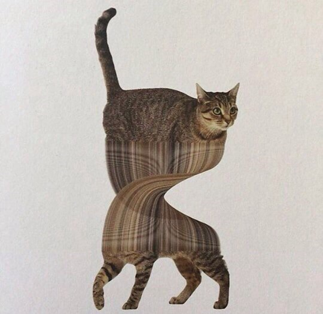
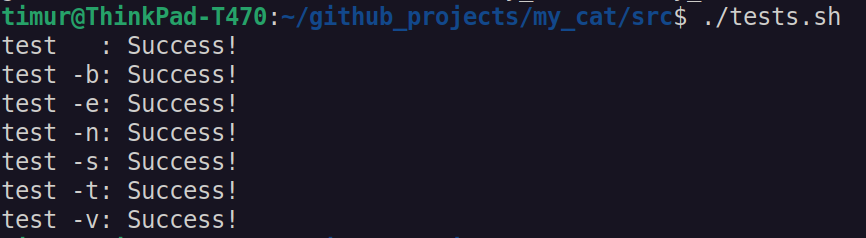
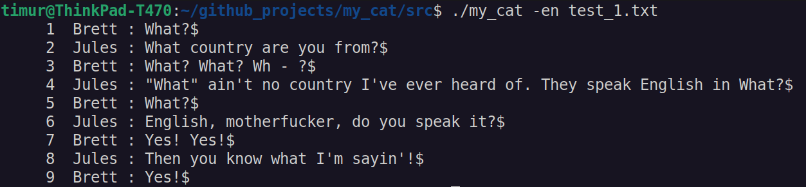

# Cat utility

## __Description of project:__
__In this project I developed my own implementation of cat text utility for Unix systems.__

Cat is one of the most frequently used commands on Unix-like operating systems. It has three related functions with regard to text files: displaying them, combining copies of them and creating new ones.

The program developed according to the principles of structured programming in C language of C11 standard using gcc compiler.

Integration tests cover all flag variants and input values, based on a comparison with the behavior of real utility _(I used cat from Ubuntu 22.04 to compare with)_ 

### cat Options

`cat [OPTION] [FILE]...`

| No. | Options | Description |
| ------ | ------ | ------ |
| 1 | -b (GNU: --number-nonblank) | numbers only non-empty lines |
| 2 | -e implies -v (GNU only: -E the same, but without implying -v) | but also display end-of-line characters as $  |
| 3 | -n (GNU: --number) | number all output lines |
| 4 | -s (GNU: --squeeze-blank) | squeeze multiple adjacent blank lines |
| 5 | -t implies -v (GNU: -T the same, but without implying -v) | but also display tabs as ^I  |

## __Compilation:__
Use make utility for building the library and tests.

## __Unit-tests and reports:__
Use bash script _tests.sh_ in src/ folder

## __Usage:__
